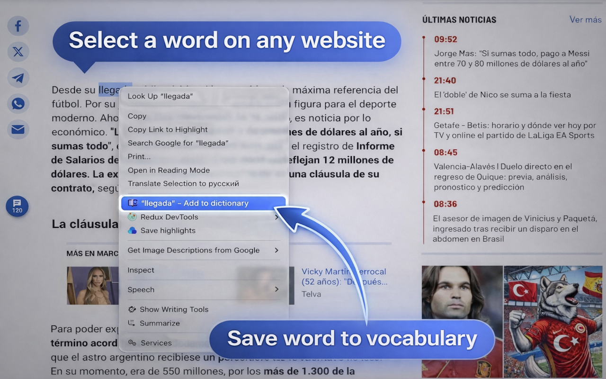
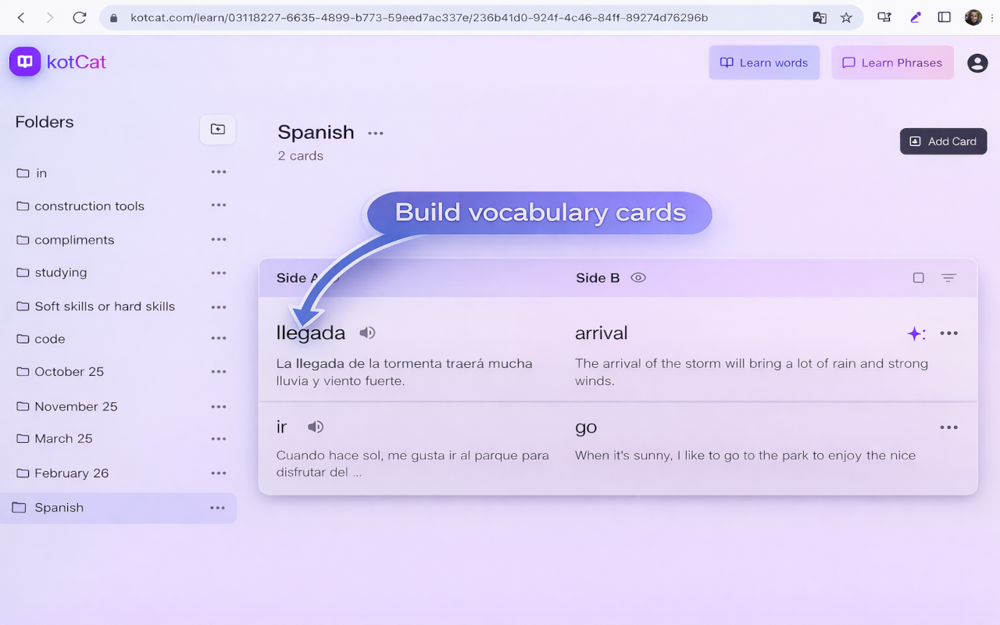
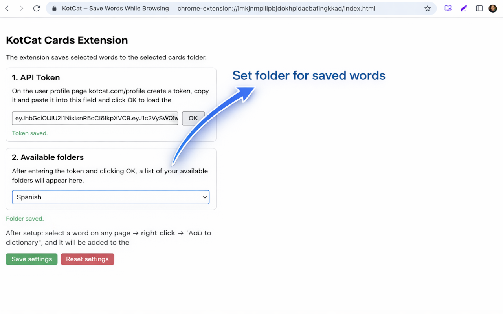

<p align="center">
  
</p>

# KotCat – Save Words While Browsing

A Chrome browser extension that helps you save words from any website while reading and create vocabulary cards with context using KotCat.

## Installation

### From Chrome Web Store

**[Install KotCat extension →](https://chromewebstore.google.com/detail/kotcat-%E2%80%93-save-words-while/hbjmiobfalkndjepaclgglgfjkfnegim)**

1. Click the link above or visit the [Chrome Web Store](https://chromewebstore.google.com/detail/kotcat-%E2%80%93-save-words-while/hbjmiobfalkndjepaclgglgfjkfnegim)
2. Click "Add to Chrome"
3. Confirm the installation

## Features

- 🎯 One-click word addition from any webpage
- 🌍 Multi-language support (7 languages)
- 🔒 Privacy-focused (local storage, secure communication)
- ⚙️ Easy configuration
- 📱 Smart context menu with word preview

### Manual Installation (Development)
1. Clone this repository
2. Run `npm install`
3. Run `npm run build`
4. Open Chrome and go to `chrome://extensions/`
5. Enable "Developer mode"
6. Click "Load unpacked"
7. Select the `dist` folder

## Setup

1. Get your API token from [kotcat.com/profile](https://kotcat.com/profile)
2. Open extension settings (right-click extension icon → Options)
3. Paste your API token and click OK
4. Select your target folder
5. Start using the extension!

## Usage

1. Select any word or phrase on any webpage
2. Right-click
3. Choose "Add to dictionary" (or "[word] - Add to dictionary")
4. The word is saved to your selected folder on kotcat.com

## Screenshots

| Context menu | Popup | Settings |
|:---:|:---:|:---:|
|  |  |  |

## Supported Languages

- English (en)
- Russian (ru)
- Spanish (es)
- Portuguese (pt)
- French (fr)
- German (de)
- Chinese (zh)

## Privacy

See [PRIVACY_POLICY.md](./PRIVACY_POLICY.md) for detailed information about data collection and privacy.

## Development

### Build
```bash
npm run build
```

### Development Mode
```bash
npm run dev
```

## Requirements

- Chrome browser (Manifest V3 compatible)
- kotcat.com account
- API token from kotcat.com

## License

[Add your license here]

## Support

For issues, questions, or feature requests, please contact us through:
- Chrome Web Store support page
- kotcat.com support

## Changelog

### Version 1.0.0
- Initial release
- Multi-language support
- Context menu integration
- Settings page
- Popup interface


